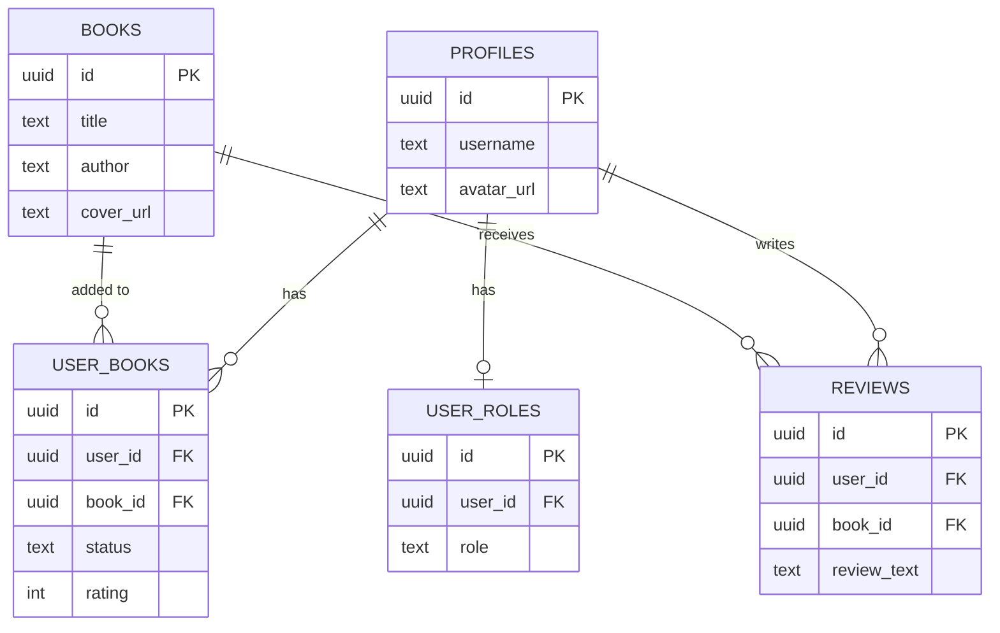

# BookTrail

A personal library and reading tracker. Browse a shared book catalog, track books as want-to-read / reading / finished, rate and review books, and manage your profile. Admins manage the book catalog and user roles.

Built as a capstone project for Software Technologies with AI.

## Live Demo

[your Netlify URL here]

**Demo credentials:**
- Regular user: `[demo email]` / `[demo password]`
- Admin user: `[demo admin email]` / `[demo password]`

## Architecture

- **Frontend:** Vanilla JavaScript (ES modules), Bootstrap 5, Vite (multi-page app — one HTML entry per screen, no client-side router)
- **Backend:** Supabase — Postgres database, Auth, and Storage
- **Deployment:** Netlify

Each screen is its own HTML file with a matching JS entry module. All Supabase calls go through `src/services/*.js`. Access control is enforced by Supabase Row Level Security policies, not just client-side checks.

## Database Schema



## Local Setup

```bash
git clone https://github.com/[your-username]/booktrail.git
cd booktrail
npm install
```

Create a `.env.local` file in the project root (copy `.env.example` and fill in real values from your own Supabase project):
```
VITE_SUPABASE_URL=your-project-url
VITE_SUPABASE_ANON_KEY=your-publishable-key
```

Run the three migration files in `supabase/migrations/` (in order) via your Supabase project's SQL Editor, then start the dev server:
```bash
npm run dev
```

## Project Structure

| Path | Purpose |
|---|---|
| `src/pages/` | Per-screen entry scripts |
| `src/components/` | Reusable UI pieces (navbar, book card, review form) |
| `src/services/` | All Supabase calls (auth, books, library, storage, admin) |
| `src/utils/` | Route guards and validators |
| `supabase/migrations/` | Database schema, RLS policies, storage setup |
| `.github/copilot-instructions.md` | Project context for AI-assisted development |

## Features

- Email/password authentication
- Browse and search the book catalog
- Personal library with want-to-read / reading / finished shelves
- Book reviews and ratings
- Profile with avatar upload
- Admin panel: manage books (with cover image upload) and user roles